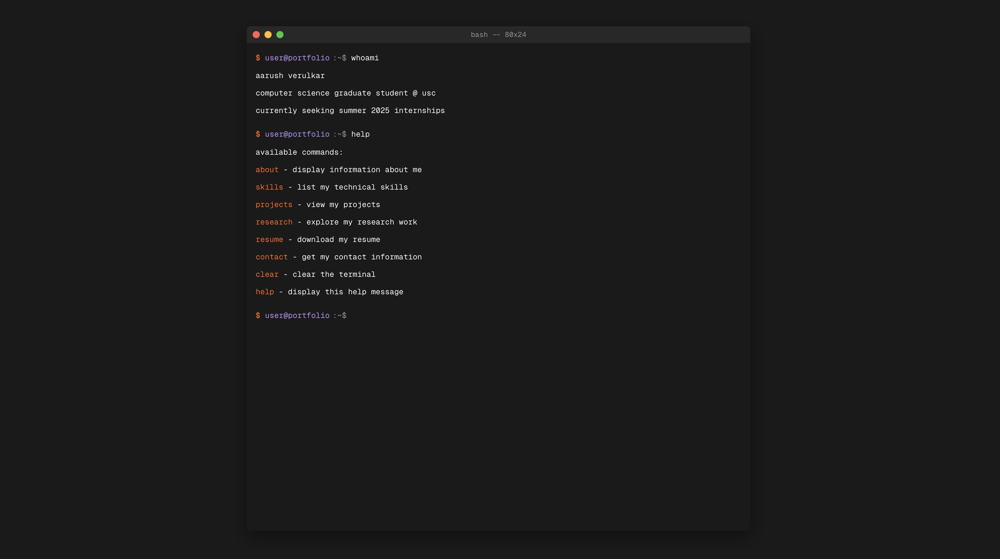

# Terminal Portfolio

A modern, interactive terminal-styled portfolio website showcasing my work and skills as a developer.



## 🚀 Features

- **Terminal-like Interface**: Navigate through my portfolio using familiar command-line syntax
- **Interactive Experience**: Type commands to discover projects, skills, and contact information
- **Responsive Design**: Works seamlessly on desktop and mobile devices
- **Custom Commands**: Easily extensible with new commands and features
- **Easter Eggs**: Hidden commands and features for the curious explorer

## 🛠️ Tech Stack

- HTML5, CSS3, JavaScript
- No external UI libraries - built from scratch
- Web Storage API for persistence
- Custom terminal parser and command handler

## 💻 Commands

| Command | Description |
|---------|-------------|
| `help` | List all available commands |
| `about` | Display information about me |
| `skills` | Show my technical skills |
| `projects` | List my projects |
| `contact` | Display contact information |
| `clear` | Clear the terminal |

## 🔧 Installation

1. Clone this repository
```bash
git@github.com:Aarush-Verulkar-USC/Portfolio-Website.git
```

2. Navigate to the project directory
```bash
cd terminal-portfolio
```

3. Open `index.html` in your browser or use a local server
```bash
# If you have Python installed
python -m http.server
# Or using Node.js
npx serve
```

## 🖥️ Development

To modify or extend this project:

1. Edit the command handlers in `js/commands.js`
2. Modify styles in `css/style.css`
3. Update project data in `js/data.js`

## 📱 Accessibility

- Full keyboard navigation
- Screen reader friendly with ARIA labels
- High contrast mode available via `theme highcontrast`

## 📄 License

This project is licensed under the MIT License - see the [LICENSE](LICENSE) file for details.

## 🙏 Acknowledgments

- Inspired by retro terminal interfaces
- Font: [Geist Mono]([https://www.jetbrains.com/lp/mono/](https://vercel.com/font))

---

Made with ❤️ by [Aarush]

*Type `help` in the terminal to get started!*
